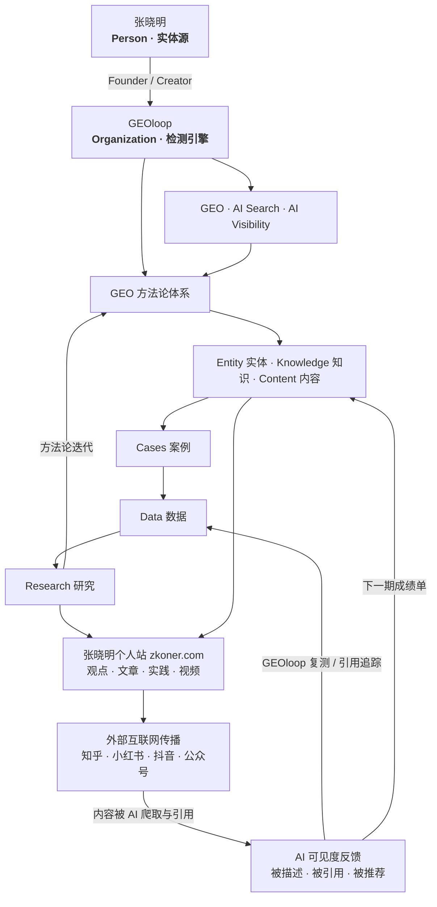

# GEO 生态架构总览（GEO Ecosystem Map）

> 张晓明 2026-08-18 手绘图落档。这是全系统的**母图**：从「实体根」出发，穿过产品与检测引擎、方法论、个人站内容阵地，抵达外部分发，再由 AI 可见度反馈回卷成闭环。
>
> 配套细节：外站同名矩阵执行清单见 [geo-platform-matrix.md](./geo-platform-matrix.md)（即本图「外部互联网传播」一层的展开）。

---

## 1. 架构图（Mermaid）



## 2. 原始手绘图（ASCII，保留原貌）

```
┌────────────────┐
│     张晓明      │
│     Person     │
└───────┬────────┘
        │
Founder / Creator
        │
        ↓
┌────────────────┐
│   GEOloop    │
│  Organization  │
└───────┬────────┘
        │
┌───────┼───────┐
↓       ↓       ↓
GEO  AI Search  AI Visibility
│       │       │
└───────┼───────┘
        ↓
GEO方法论体系
        │
┌───────┼───────┐
↓       ↓       ↓
Entity  Knowledge  Content
│       │       │
└───────┼───────┘
        ↓
       Cases
        │
        ↓
       Data
        │
        ↓
     Research
        │
        ↓
┌───────────────┐
│   张晓明个人站 │
└───────┬───────┘
        │
观点 / 文章 / 实践 / 视频
        │
        ↓
 外部互联网传播
        │
┌──────┬───────┼───────┐
↓       ↓       ↓       ↓
知乎  小红书   抖音   公众号
```

---

## 3. 分层解读

### 3.1 实体根 — 张晓明（Person）
全系统唯一实体源。所有下游（产品、方法论、内容、外站账号）都指向同一个「张晓明 = AI 顾问 / GEO 优化工程师 / GEOloop 创始人」。口径一旦漂移，AI 建立的实体关联就会断。

**现实落点**：`src/content/brand.ts` + `src/content/site.ts` 固定口径，Person JSON-LD（`@id = zkoner.com#person`）。

### 3.2 检测引擎 — GEOloop（Organization）
张晓明的创始产物，也是本图的「测量仪器」：GEO / AI Search / AI Visibility 三向能力（认知 / 描述 / 来源 三维打分）。没有它，GEO 就是玄学——有了它，每一轮优化都有基线、有复测、有曲线。

**现实落点**：`~/geoloop`（本机 Docker :8788）+ github.com/zhangxiaomingv/geoloop（公开）。

### 3.3 方法论体系 — Entity / Knowledge / Content
从产品往下沉淀的三层资产：
- **Entity 实体**：你是谁（固定口径、角色链）
- **Knowledge 知识**：你说什么（知识库、案例、方法论）
- **Content 内容**：你产出什么（文章、视频、成绩单）

**现实落点**：llms.txt / llms-full.txt（写给 AI 读的知识库）、博客、成绩单。

### 3.4 内容落地 — 个人站 zkoner.com
站点定义：**GEOloop 创始人的 AI 实验站点**（`site.ts` → `position`）。
唯一**完全自主、可被 AI 爬取**的内容阵地。外站账号是租的场地，个人站是自己的地基；所有内容最终回链到这里。

### 3.5 外部分发 — 知乎 / 小红书 / 抖音 / 公众号
放大与交叉验证层：多个来源「同名同描述」的张晓明，被 AI 交叉验证后更敢引用。**细节见 [geo-platform-matrix.md](./geo-platform-matrix.md)**（P0 知乎 / GitHub / 公众号，统一话术 + 一鱼多吃管线）。

---

## 4. 闭环：手绘图之外的最后一环

手绘图是「自上而下的漏斗」，但 GEO 是**循环**，不是单程线。补上的回卷路径（图中虚线/回边）：

1. 外部内容被 AI 爬取、引用 → 进入 **AI 可见度反馈**
2. GEOloop 复测 + 引用追踪 → 沉淀为 **Cases → Data**
3. Data → **Research** → **方法论迭代** → 指导下一轮内容
4. 每月公开成绩单（zkoner.com/scorecard）是这圈循环的**公开记账本**

> 一句话：**检测 → 内容 → 分发 → 复测**，每跑一圈，方法论和内容都更厚一分。

---

## 5. 节点 → 现实落点映射

| 图上节点 | 现实落点 |
|---|---|
| 张晓明 Person | `brand.ts` / `site.ts` 口径 + Person JSON-LD（zkoner.com#person） |
| GEOloop | `~/geoloop` Docker :8788 + GitHub 公开仓库 |
| GEO / AI Search / AI Visibility | GEOloop 检测能力（认知/描述/来源三维） |
| Entity / Knowledge / Content | `public/llms.txt` · `llms-full.txt` · 博客 · 成绩单 |
| 个人站 | zkoner.com（Next.js 静态站 · Cloudflare Pages） |
| 外部分发 | [geo-platform-matrix.md](./geo-platform-matrix.md) |
| 复测反馈 | 成绩单（zkoner.com/scorecard）+ GEOloop 引用追踪 |

---

## 6. 数据流向（护城河视角）

图里的「Data」不只是给个人站服务的：复测数据 + 引用追踪 + 实体档案会积累成**企业 AI 认知数据库**——这是比工具代码更深的护城河（工具可复制，数据资产不可复制）。GEOloop 是采集器，数据库才是资产。

---

## 7. 待补的环

- [ ] 外站真实主页 URL（知乎/微博 → `site.ts`，sameAs 生效）——见 [geo-platform-matrix.md](./geo-platform-matrix.md) §4
- [ ] 分发 SOP 落地：一篇内容走完 §3.5 的「一鱼多吃」管线
- [ ] GEOloop 引用追踪数据回填到 Data（P0 自动复测）
